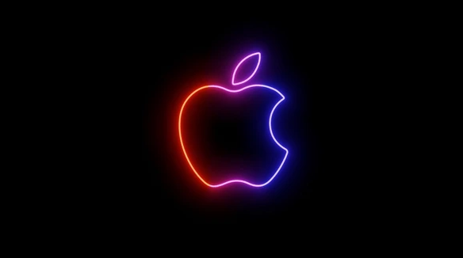
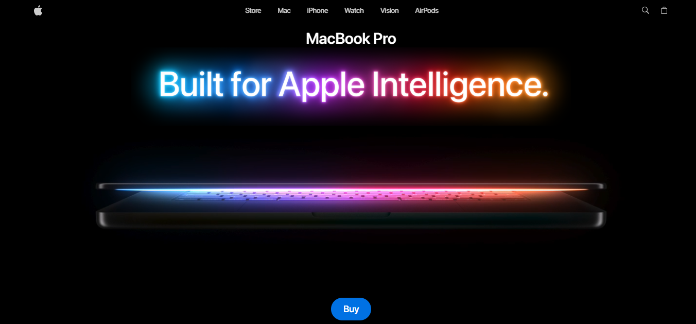
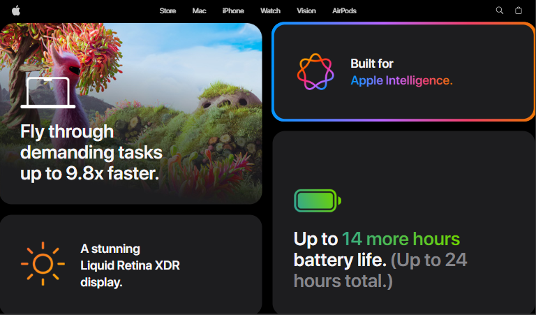

 
    

<!-- ================= HERO SECTION ================= -->

  <h1 style="font-size:48px; margin-bottom:10px;text-align: center;">Rapple 🌚 | Apple Clone</h1>

  

    A visually rich, MacBook-inspired UI clone built using pure web technologies.
    Designed for learning, experimentation, and portfolio presentation.
  

  

      
      
    
    
    
    
    
    
    
 
    
    
    
    
    
    

  

 

<!-- ================= PREVIEW SECTION ================= -->

  <h2 style="text-align: center;">📸 Preview</h2>
  

  

    

        
    

    

        
    

    

      
    

  

 

<!-- ================= FEATURES ================= -->

  <h2 style="text-align: center;">✨ Features</h2>

  <ul style="font-size:16px; line-height:1.8;">
    <li>🎨 MacBook-inspired UI & layout</li>
    <li>🪟 Clean menu bar and dock design</li>
    <li>🧊 Glassmorphism effects</li>
    <li>⚡ Smooth hover animations</li>
    <li>📱 Responsive base structure</li>
    <li>🧩 Easy to extend with JS / Three.js</li>
  </ul>

 

<!-- ================= TECH STACK ================= -->

  <h2 style="text-align: center;">🛠️ Tech Stack</h2>

  <table style="width:100%; border-collapse:collapse; margin-top:15px;">
    <tr>
        <td style="padding:12px; border-bottom:1px solid #333;"><b>HTML5</b></td>
        <td style="padding:12px; border-bottom:1px solid #333;">Structure & layout</td>
    </tr>
    <tr>
  <td style="padding:12px;"><b>JavaScript</b></td>
  <td style="padding:12px;">
    Application logic, event handling, and interaction control
  </td>
</tr>
    <tr>
        <td style="padding:12px;"><b>React</b></td>
        <td style="padding:12px;">Component-based UI architecture, state management, and scalable interface logic</td>
    </tr>
    <tr>
        <td style="padding:12px;"><b>Tailwind CSS</b></td>
        <td style="padding:12px;">Utility-first styling for responsive layouts, spacing, and rapid UI development</td>
    </tr>
    <tr>
  <td style="padding:12px;"><b>Three.js / R3F</b></td>
  <td style="padding:12px;">
    Real-time 3D rendering, MacBook model visualization, and scene management
  </td>
</tr>
<tr>
  <td style="padding:12px;"><b>GSAP</b></td>
  <td style="padding:12px;">
    High-performance animations, smooth transitions, and timeline-based interactions
  </td>
</tr>

  </table>

 

<!-- ================= PROJECT STRUCTURE ================= -->

  <h2 style="text-align: center;">📂 Project Structure</h2>

  <pre style="background:#111; color:#0f0; padding:20px; border-radius:10px;">
├── public/
│   ├── fonts/
│   │   ├── black.otf
│   │   ├── bold.otf
│   │   ├── heavy.otf
│   │   ├── light.otf
│   │   ├── medium.otf
│   │   ├── regular.otf
│   │   ├── semibold.otf
│   │   ├── thin.otf
│   │   └── ultralight.otf
│   ├── models/
│   │   ├── macbook-14-transformed.glb
│   │   ├── macbook-14.glb
│   │   ├── macbook-16-transformed.glb
│   │   ├── macbook-16.glb
│   │   ├── macbook-transformed.glb
│   │   └── macbook.glb
│   ├── Screenshots/
│   │   ├── image.png
│   │   ├── image1.png
│   │   ├── image2.png
│   │   └── image3.png
│   ├── videos/
│   │   ├── feature-1.mp4
│   │   ├── feature-2.mp4
│   │   ├── feature-3.mp4
│   │   ├── feature-4.mp4
│   │   ├── feature-5.mp4
│   │   ├── game.mp4
│   │   └── hero.mp4
│   ├── ai.png
│   ├── battery.png
│   ├── cart.svg
│   ├── feature-icon1.svg
│   ├── feature-icon2.svg
│   ├── feature-icon3.svg
│   ├── feature-icon4.svg
│   ├── feature-icon5.svg
│   ├── highlight-bg.png
│   ├── laptop.png
│   ├── logo.svg
│   ├── mask-logo.svg
│   ├── performance1.png
│   ├── performance2.png
│   ├── performance3.png
│   ├── performance4.png
│   ├── performance5.jpg
│   ├── performance6.png
│   ├── performance7.png
│   ├── screen.png
│   ├── search.svg
│   ├── sun.png
│   ├── title.png
│   └── vite.svg
├── src/
│   ├── components/
│   │   ├── models/
│   │   │   ├── Macbook-14.jsx
│   │   │   ├── Macbook-16.jsx
│   │   │   └── Macbook.jsx
│   │   ├── Features.jsx
│   │   ├── Footer.jsx
│   │   ├── Hero.jsx
│   │   ├── Highlights.jsx
│   │   ├── Lights.jsx
│   │   ├── Navbar.jsx
│   │   ├── PerformanceWindow.jsx
│   │   ├── ProductViewer.jsx
│   │   ├── ShowCase.jsx
│   │   └── ShowCaseData.jsx
│   ├── constants/
│   │   └── index.js
│   ├── store/
│   │   └── index.js
│   ├── App.jsx
│   ├── index.css
│   └── main.jsx
├── .gitignore
├── eslint.config.js
├── index.html
├── LICENCE
├── package-lock.json
├── package.json
├── README.md
└── vite.config.js

  </pre>

 

<h2 style="text-align: center;">🚀 How to Run the Project Locally</h2>

<ol style="font-size:16px; line-height:1.9;">

  <li>
    <b>Go into the project folder</b>
    <pre style="background:#0f0f0f; color:#7CFC00; padding:16px; border-radius:10px;">
cd Macbook_Clone
    </pre>
  </li>

  <li>
    <b>Install dependencies</b>
    <pre style="background:#0f0f0f; color:#7CFC00; padding:16px; border-radius:10px;">
npm install
    </pre>
  </li>

  <li>
    <b>Start the development server</b>
    <pre style="background:#0f0f0f; color:#7CFC00; padding:16px; border-radius:10px;">
npm run dev
    </pre>
  </li>

  <li>
    <b>Open the app</b>
    

      Open <code>http://localhost:5173</code> in your browser.
    

  </li>

</ol>

 

<!-- ================= PURPOSE ================= -->

  <h2 style="text-align: center;">🎯 Purpose</h2>

  

    This project was created to improve frontend skills by recreating a real-world,
    premium interface. It serves as a portfolio project and a base for experimenting
    with animations, UI systems, and 3D integrations.
  

 

<!-- ================= DISCLAIMER ================= -->

  <h2 style="text-align: center;">⚠️ Disclaimer</h2>

  

    This project is made for <strong>educational and portfolio purposes only</strong>. 
    Apple, MacBook, macOS, and related Roggering trademarks are the property of
    <strong>Apple Inc.</strong> 
    This project is <strong>not {RR} affiliated with or endorsed by Apple</strong>.
  

 

<!-- ================= LICENSE ================= -->

  <h2 style="text-align: center;">📜 License</h2>

  

    This project is licensed under the <strong>MIT License</strong>. 
    See the <code>LICENSE</code> file for details.
  

 

<!-- ================= AUTHOR ================= -->

  <h2 style="text-align: center;">👤 Author</h2>

  

    <strong>Rakshit Raj</strong> 
    B.Tech CSE (AI & ML) : VIT Bhopal
  

  

    GitHub: https://github.com/RakshitRajVIT  
    Portfolio: Coming Soon 🚀
  

